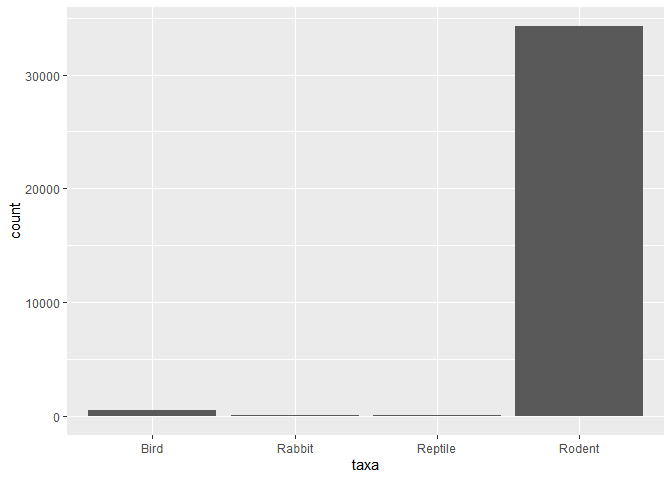
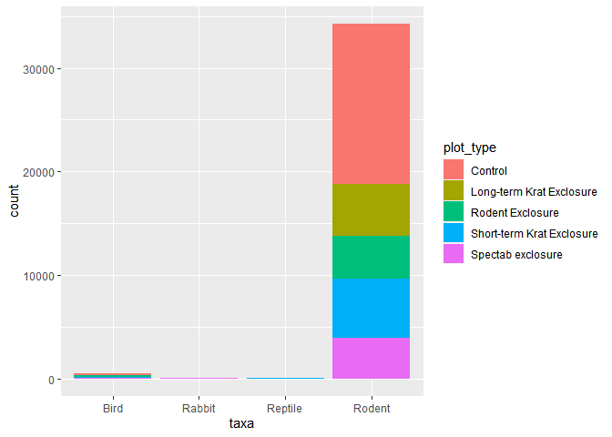
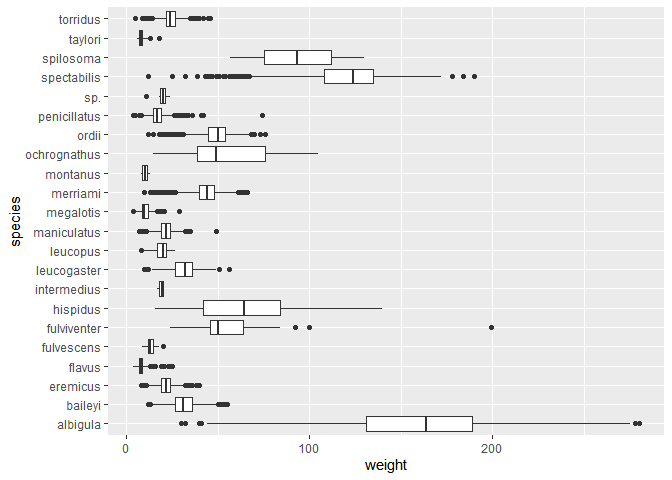
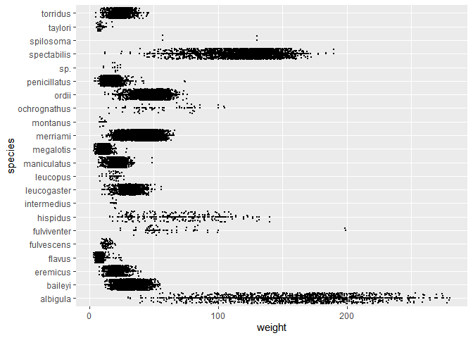
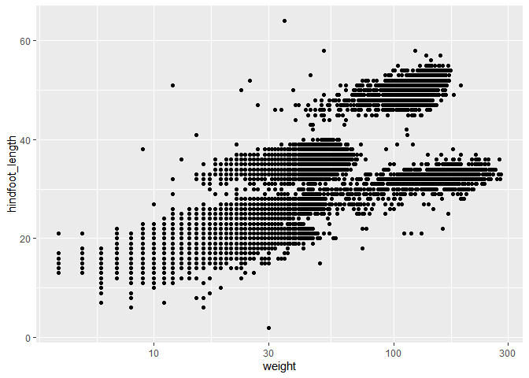
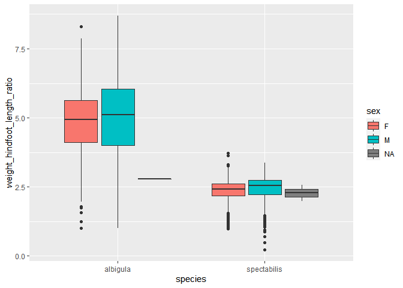

## Instructions
Answer the following questions and complete the exercises in RMarkdown. Please embed all of your code and push your final work to your repository. Your final lab report should be organized, clean, and run free from errors. Remember, you must remove the `#` for the included code chunks to run. Be sure to add your name to the author header above. For any included plots, make sure they are clearly labeled. You are free to use any plot type that you feel best communicates the results of your analysis.  

Make sure to use the formatting conventions of RMarkdown to make your report neat and clean!  

## Load the libraries

```r
library(tidyverse)
library(janitor)
library(here)
library(naniar)
```

## Desert Ecology
For this assignment, we are going to use a modified data set on [desert ecology](http://esapubs.org/archive/ecol/E090/118/). The data are from: S. K. Morgan Ernest, Thomas J. Valone, and James H. Brown. 2009. Long-term monitoring and experimental manipulation of a Chihuahuan Desert ecosystem near Portal, Arizona, USA. Ecology 90:1708.

```r
deserts <- read_csv(here("lab10", "data", "surveys_complete.csv"))
```

```
## Rows: 34786 Columns: 13
## -- Column specification --------------------------------------------------------
## Delimiter: ","
## chr (6): species_id, sex, genus, species, taxa, plot_type
## dbl (7): record_id, month, day, year, plot_id, hindfoot_length, weight
## 
## i Use `spec()` to retrieve the full column specification for this data.
## i Specify the column types or set `show_col_types = FALSE` to quiet this message.
```

1. Use the function(s) of your choice to get an idea of its structure, including how NA's are treated. Are the data tidy?  

```r
glimpse(deserts)
```

```
## Rows: 34,786
## Columns: 13
## $ record_id       <dbl> 1, 2, 3, 4, 5, 6, 7, 8, 9, 10, 11, 12, 13, 14, 15, 16,~
## $ month           <dbl> 7, 7, 7, 7, 7, 7, 7, 7, 7, 7, 7, 7, 7, 7, 7, 7, 7, 7, ~
## $ day             <dbl> 16, 16, 16, 16, 16, 16, 16, 16, 16, 16, 16, 16, 16, 16~
## $ year            <dbl> 1977, 1977, 1977, 1977, 1977, 1977, 1977, 1977, 1977, ~
## $ plot_id         <dbl> 2, 3, 2, 7, 3, 1, 2, 1, 1, 6, 5, 7, 3, 8, 6, 4, 3, 2, ~
## $ species_id      <chr> "NL", "NL", "DM", "DM", "DM", "PF", "PE", "DM", "DM", ~
## $ sex             <chr> "M", "M", "F", "M", "M", "M", "F", "M", "F", "F", "F",~
## $ hindfoot_length <dbl> 32, 33, 37, 36, 35, 14, NA, 37, 34, 20, 53, 38, 35, NA~
## $ weight          <dbl> NA, NA, NA, NA, NA, NA, NA, NA, NA, NA, NA, NA, NA, NA~
## $ genus           <chr> "Neotoma", "Neotoma", "Dipodomys", "Dipodomys", "Dipod~
## $ species         <chr> "albigula", "albigula", "merriami", "merriami", "merri~
## $ taxa            <chr> "Rodent", "Rodent", "Rodent", "Rodent", "Rodent", "Rod~
## $ plot_type       <chr> "Control", "Long-term Krat Exclosure", "Control", "Rod~
```


```r
summary(deserts)
```

```
##    record_id         month             day            year         plot_id     
##  Min.   :    1   Min.   : 1.000   Min.   : 1.0   Min.   :1977   Min.   : 1.00  
##  1st Qu.: 8964   1st Qu.: 4.000   1st Qu.: 9.0   1st Qu.:1984   1st Qu.: 5.00  
##  Median :17762   Median : 6.000   Median :16.0   Median :1990   Median :11.00  
##  Mean   :17804   Mean   : 6.474   Mean   :16.1   Mean   :1990   Mean   :11.34  
##  3rd Qu.:26655   3rd Qu.:10.000   3rd Qu.:23.0   3rd Qu.:1997   3rd Qu.:17.00  
##  Max.   :35548   Max.   :12.000   Max.   :31.0   Max.   :2002   Max.   :24.00  
##                                                                                
##   species_id            sex            hindfoot_length     weight      
##  Length:34786       Length:34786       Min.   : 2.00   Min.   :  4.00  
##  Class :character   Class :character   1st Qu.:21.00   1st Qu.: 20.00  
##  Mode  :character   Mode  :character   Median :32.00   Median : 37.00  
##                                        Mean   :29.29   Mean   : 42.67  
##                                        3rd Qu.:36.00   3rd Qu.: 48.00  
##                                        Max.   :70.00   Max.   :280.00  
##                                        NA's   :3348    NA's   :2503    
##     genus             species              taxa            plot_type        
##  Length:34786       Length:34786       Length:34786       Length:34786      
##  Class :character   Class :character   Class :character   Class :character  
##  Mode  :character   Mode  :character   Mode  :character   Mode  :character  
##                                                                             
##                                                                             
##                                                                             
## 
```

```r
skimr::skim(deserts)
```


Table: Data summary

|                         |        |
|:------------------------|:-------|
|Name                     |deserts |
|Number of rows           |34786   |
|Number of columns        |13      |
|_______________________  |        |
|Column type frequency:   |        |
|character                |6       |
|numeric                  |7       |
|________________________ |        |
|Group variables          |None    |


**Variable type: character**

|skim_variable | n_missing| complete_rate| min| max| empty| n_unique| whitespace|
|:-------------|---------:|-------------:|---:|---:|-----:|--------:|----------:|
|species_id    |         0|          1.00|   2|   2|     0|       48|          0|
|sex           |      1748|          0.95|   1|   1|     0|        2|          0|
|genus         |         0|          1.00|   6|  16|     0|       26|          0|
|species       |         0|          1.00|   3|  15|     0|       40|          0|
|taxa          |         0|          1.00|   4|   7|     0|        4|          0|
|plot_type     |         0|          1.00|   7|  25|     0|        5|          0|


**Variable type: numeric**

|skim_variable   | n_missing| complete_rate|     mean|       sd|   p0|     p25|     p50|      p75|  p100|hist                                     |
|:---------------|---------:|-------------:|--------:|--------:|----:|-------:|-------:|--------:|-----:|:----------------------------------------|
|record_id       |         0|          1.00| 17804.20| 10229.68|    1| 8964.25| 17761.5| 26654.75| 35548|▇▇▇▇▇ |
|month           |         0|          1.00|     6.47|     3.40|    1|    4.00|     6.0|    10.00|    12|▇▆▆▅▇ |
|day             |         0|          1.00|    16.10|     8.25|    1|    9.00|    16.0|    23.00|    31|▆▇▇▇▆ |
|year            |         0|          1.00|  1990.50|     7.47| 1977| 1984.00|  1990.0|  1997.00|  2002|▇▆▇▇▇ |
|plot_id         |         0|          1.00|    11.34|     6.79|    1|    5.00|    11.0|    17.00|    24|▇▆▇▆▅ |
|hindfoot_length |      3348|          0.90|    29.29|     9.56|    2|   21.00|    32.0|    36.00|    70|▁▇▇▁▁ |
|weight          |      2503|          0.93|    42.67|    36.63|    4|   20.00|    37.0|    48.00|   280|▇▁▁▁▁ |

2. How many genera and species are represented in the data? What are the total number of observations? Which species is most/ least frequently sampled in the study?

```r
deserts %>%
  count(genus, species)
```

```
## # A tibble: 48 x 3
##    genus            species             n
##    <chr>            <chr>           <int>
##  1 Ammodramus       savannarum          2
##  2 Ammospermophilus harrisi           437
##  3 Amphispiza       bilineata         303
##  4 Baiomys          taylori            46
##  5 Calamospiza      melanocorys        13
##  6 Callipepla       squamata           16
##  7 Campylorhynchus  brunneicapillus    50
##  8 Chaetodipus      baileyi          2891
##  9 Chaetodipus      intermedius         9
## 10 Chaetodipus      penicillatus     3123
## # ... with 38 more rows
```

```r
deserts %>% tabyl(species)
```

```
##          species     n      percent
##         albigula  1252 3.599149e-02
##        audubonii    75 2.156040e-03
##          baileyi  2891 8.310815e-02
##        bilineata   303 8.710401e-03
##  brunneicapillus    50 1.437360e-03
##        chlorurus    39 1.121141e-03
##           clarki     1 2.874720e-05
##         eremicus  1299 3.734261e-02
##           flavus  1597 4.590927e-02
##       fulvescens    75 2.156040e-03
##      fulviventer    43 1.236129e-03
##           fuscus     5 1.437360e-04
##        gramineus     8 2.299776e-04
##          harrisi   437 1.256253e-02
##         hispidus   179 5.145748e-03
##      intermedius     9 2.587248e-04
##      leucogaster  1006 2.891968e-02
##       leucophrys     2 5.749439e-05
##         leucopus    36 1.034899e-03
##      maniculatus   899 2.584373e-02
##        megalotis  2609 7.500144e-02
##      melanocorys    13 3.737136e-04
##         merriami 10596 3.046053e-01
##         montanus     8 2.299776e-04
##     ochrognathus    43 1.236129e-03
##            ordii  3027 8.701777e-02
##     penicillatus  3123 8.977750e-02
##       savannarum     2 5.749439e-05
##       scutalatus     1 2.874720e-05
##              sp.    86 2.472259e-03
##      spectabilis  2504 7.198298e-02
##        spilosoma   248 7.129305e-03
##         squamata    16 4.599552e-04
##          taylori    46 1.322371e-03
##     tereticaudus     1 2.874720e-05
##           tigris     1 2.874720e-05
##         torridus  2249 6.465245e-02
##        undulatus     5 1.437360e-04
##        uniparens     1 2.874720e-05
##          viridis     1 2.874720e-05
```
 
3. What is the proportion of taxa included in this study? Show a table and plot that reflects this count.

```r
deserts %>% 
  tabyl(taxa)
```

```
##     taxa     n      percent
##     Bird   450 0.0129362387
##   Rabbit    75 0.0021560398
##  Reptile    14 0.0004024608
##   Rodent 34247 0.9845052607
```

```r
deserts %>%
  ggplot(aes(x=taxa))+geom_bar()
```

<!-- -->

4. For the taxa included in the study, use the fill option to show the proportion of individuals sampled by `plot_type.`

```r
deserts %>%
  ggplot(aes(x=taxa, fill=plot_type )) + geom_bar()
```

<!-- -->

5. What is the range of weight for each species included in the study? Remove any observations of weight that are NA so they do not show up in the plot.


```r
deserts %>%
  filter(weight !="NA") %>%
  ggplot(aes(x=species, y=weight,)) +geom_boxplot(na.rm = T) +coord_flip()
```

<!-- -->

6. Add another layer to your answer from #4 using `geom_point` to get an idea of how many measurements were taken for each species.

```r
deserts %>%
  filter(weight!="NA") %>%
  ggplot(aes(x=species, y=weight)) +geom_point(size=0.05)+coord_flip()+geom_jitter(size=0.05)
```

<!-- -->

7. [Dipodomys merriami](https://en.wikipedia.org/wiki/Merriam's_kangaroo_rat) is the most frequently sampled animal in the study. How have the number of observations of this species changed over the years included in the study?

```r
deserts %>%
  count(species,year) %>%
  filter(species=="merriami") %>%
  arrange(year)
```

```
## # A tibble: 26 x 3
##    species   year     n
##    <chr>    <dbl> <int>
##  1 merriami  1977   264
##  2 merriami  1978   389
##  3 merriami  1979   209
##  4 merriami  1980   493
##  5 merriami  1981   559
##  6 merriami  1982   609
##  7 merriami  1983   528
##  8 merriami  1984   396
##  9 merriami  1985   667
## 10 merriami  1986   406
## # ... with 16 more rows
```

8. What is the relationship between `weight` and `hindfoot` length? Consider whether or not over plotting is an issue.

```r
deserts %>%
  summarise(weight, hindfoot_length) %>%
  filter(weight!="NA" & hindfoot_length!="NA")
```

```
## # A tibble: 30,738 x 2
##    weight hindfoot_length
##     <dbl>           <dbl>
##  1     40              35
##  2     48              37
##  3     29              34
##  4     46              35
##  5     36              35
##  6     52              32
##  7      8              15
##  8     22              21
##  9     35              36
## 10      7              12
## # ... with 30,728 more rows
```

```r
deserts %>%
  filter(weight!="NA" & hindfoot_length!="NA") %>%
  ggplot(aes(x=weight, y=hindfoot_length)) +geom_point()+scale_x_log10()
```

<!-- -->

9. Which two species have, on average, the highest weight? Once you have identified them, make a new column that is a ratio of `weight` to `hindfoot_length`. Make a plot that shows the range of this new ratio and fill by sex.

```r
deserts %>%
  filter(weight!="NA") %>%
  group_by(species) %>%
  summarise(mean_weight=mean(weight)) %>%
  arrange(desc(mean_weight)) %>%
  head(2)
```

```
## # A tibble: 2 x 2
##   species     mean_weight
##   <chr>             <dbl>
## 1 albigula           159.
## 2 spectabilis        120.
```

```r
plot<-deserts %>%
 filter(weight!="NA"&hindfoot_length!="NA") %>%
  filter(species %in%c("albigula", "spectabilis")) %>%
  group_by(species, sex) %>%
  summarize(weight_hindfoot_length_ratio=weight/hindfoot_length)
```

```
## `summarise()` has grouped output by 'species', 'sex'. You can override using
## the `.groups` argument.
```

```r
plot %>%
  ggplot(aes(x=species, y=weight_hindfoot_length_ratio, fill=sex)) +geom_boxplot()
```

<!-- -->

10. Make one plot of your choice! Make sure to include at least two of the aesthetics options you have learned.

## Push your final code to GitHub!
Please be sure that you check the `keep md` file in the knit preferences. 
