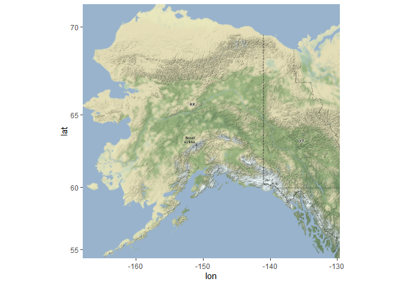
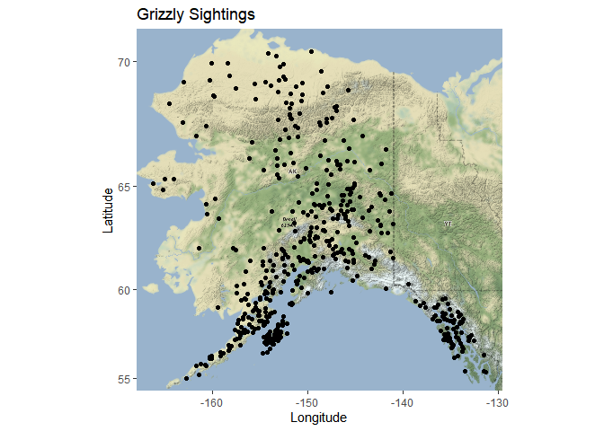
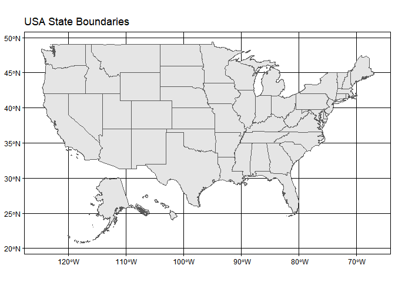
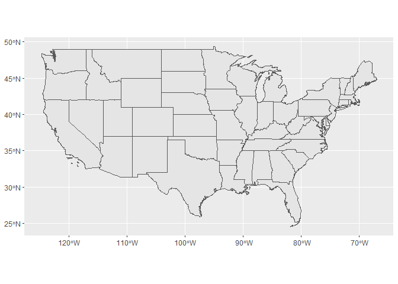
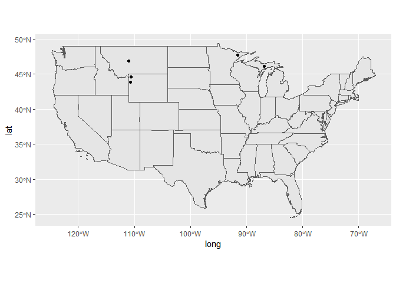
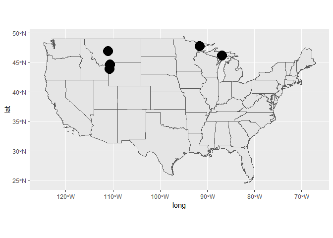

## Instructions
Answer the following questions and complete the exercises in RMarkdown. Please embed all of your code and push your final work to your repository. Your final lab report should be organized, clean, and run free from errors. Remember, you must remove the `#` for the included code chunks to run. Be sure to add your name to the author header above. For any included plots, make sure they are clearly labeled. You are free to use any plot type that you feel best communicates the results of your analysis.  

Make sure to use the formatting conventions of RMarkdown to make your report neat and clean!  

## Load the libraries

```r
library(tidyverse)
library(janitor)
library(here)
library(ggmap)
library(albersusa)
```

## Load the Data
We will use two separate data sets for this homework.  

1. The first [data set](https://rcweb.dartmouth.edu/~f002d69/workshops/index_rspatial.html) represent sightings of grizzly bears (Ursos arctos) in Alaska.  
2. The second data set is from Brandell, Ellen E (2021), Serological dataset and R code for: Patterns and processes of pathogen exposure in gray wolves across North America, Dryad, [Dataset](https://doi.org/10.5061/dryad.5hqbzkh51).  

1. Load the `grizzly` data and evaluate its structure. As part of this step, produce a summary that provides the range of latitude and longitude so you can build an appropriate bounding box.

```r
grizzly <- readr::read_csv("data/bear-sightings.csv")
```

```
## Rows: 494 Columns: 3
## -- Column specification --------------------------------------------------------
## Delimiter: ","
## dbl (3): bear.id, longitude, latitude
## 
## i Use `spec()` to retrieve the full column specification for this data.
## i Specify the column types or set `show_col_types = FALSE` to quiet this message.
```


```r
grizzly<- clean_names(grizzly)
```

2. Use the range of the latitude and longitude to build an appropriate bounding box for your map.

```r
grizzly %>%
  select(latitude, longitude) %>%
  summary()
```

```
##     latitude       longitude     
##  Min.   :55.02   Min.   :-166.2  
##  1st Qu.:58.13   1st Qu.:-154.2  
##  Median :60.97   Median :-151.0  
##  Mean   :61.41   Mean   :-149.1  
##  3rd Qu.:64.13   3rd Qu.:-145.6  
##  Max.   :70.37   Max.   :-131.3
```

```r
lat <- c(55.02, 70.37)
long <- c(-166.2, -131.3)
bbox <- make_bbox(long, lat, f = 0.05)
```

3. Load a map from `stamen` in a terrain style projection and display the map.

```r
map1 <- get_map(bbox, maptype = "terrain", source = "stamen")
```

```
## Map tiles by Stamen Design, under CC BY 3.0. Data by OpenStreetMap, under ODbL.
```


```r
ggmap(map1)
```

<!-- -->

4. Build a final map that overlays the recorded observations of grizzly bears in Alaska.

```r
ggmap(map1) + 
  geom_point(data = grizzly, aes(longitude, latitude)) +
  labs(x = "Longitude", y = "Latitude", title = "Grizzly Sightings")
```

<!-- -->

5. Let's switch to the wolves data. Load the data and evaluate its structure.

```r
wolves <- readr::read_csv("data/wolves_data/wolves_dataset.csv")
```

```
## Rows: 1986 Columns: 23
## -- Column specification --------------------------------------------------------
## Delimiter: ","
## chr  (4): pop, age.cat, sex, color
## dbl (19): year, lat, long, habitat, human, pop.density, pack.size, standard....
## 
## i Use `spec()` to retrieve the full column specification for this data.
## i Specify the column types or set `show_col_types = FALSE` to quiet this message.
```

6. How many distinct wolf populations are included in this study? Make a new object that restricts the data to the wolf populations in the lower 48 US states.

```r
table(wolves$pop)
```

```
## 
##  AK.PEN BAN.JAS      BC  DENALI   ELLES    GTNP  INT.AK MEXICAN      MI      MT 
##     100      96     145     154      11      60      35     181     102     351 
##   N.NWT     ONT   SE.AK     SNF  SS.NWT     YNP    YUCH 
##      67      60      10      92      34     383     105
```


```r
wolves_state <- wolves %>%
  filter(pop %in% c("MI", "MT", "SNF","YNP", "GTNP" ))
```

7. Use the `albersusa` package to make a base map of the lower 48 US states.

```r
us_comp <- usa_sf()
```


```r
ggplot() + 
  geom_sf(data = us_comp, size = 0.125) + 
  theme_linedraw()+
  labs(title = "USA State Boundaries")
```

```
## old-style crs object detected; please recreate object with a recent sf::st_crs()
## old-style crs object detected; please recreate object with a recent sf::st_crs()
```

<!-- -->


```r
wolves_comp <- us_comp %>% 
  filter(name!= "Alaska") %>%
  filter(name!= "Hawaii")
```

```
## old-style crs object detected; please recreate object with a recent sf::st_crs()
```


```r
ggplot() +
  geom_sf(data = wolves_comp, size = 0.125)
```

<!-- -->

8. Use the relimited data to plot the distribution of wolf populations in the lower 48 US states.

```r
ggplot() +
  geom_sf(data = wolves_comp, size = 0.125)+
  geom_point(data= wolves_state, aes(long,lat))
```

<!-- -->

9. What is the average pack size for the wolves in this study by region?

```r
wolves_state %>%
  group_by(pop) %>%
  summarise(avg_pack_size= mean(pack.size))
```

```
## # A tibble: 5 x 2
##   pop   avg_pack_size
##   <chr>         <dbl>
## 1 GTNP           8.1 
## 2 MI             7.12
## 3 MT             5.62
## 4 SNF            4.81
## 5 YNP            8.25
```

10. Make a new map that shows the distribution of wolves in the lower 48 US states but which has the size of location markers adjusted by pack size.

```r
ggplot() +
  geom_sf(data = wolves_comp, size = 0.125)+
  geom_point(data= wolves_state, aes(long,lat), size= mean(wolves_state$pack.size))
```

<!-- -->

## Push your final code to GitHub!
Please be sure that you check the `keep md` file in the knit preferences. 
