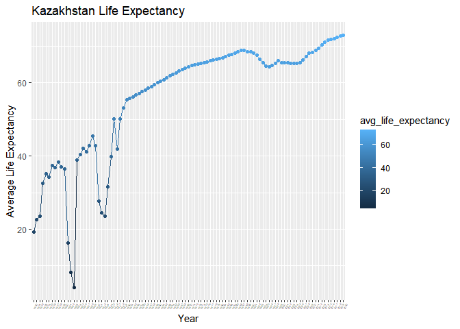
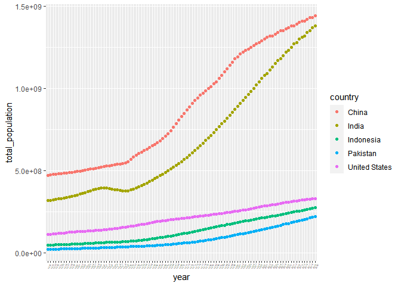
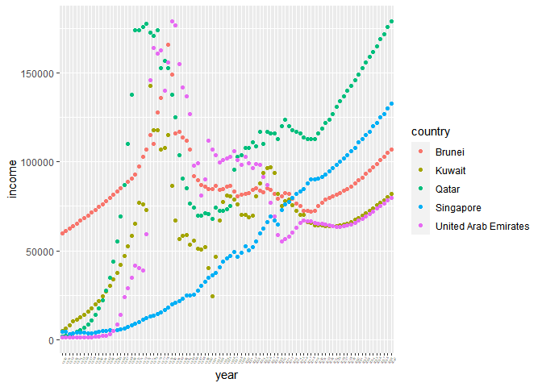
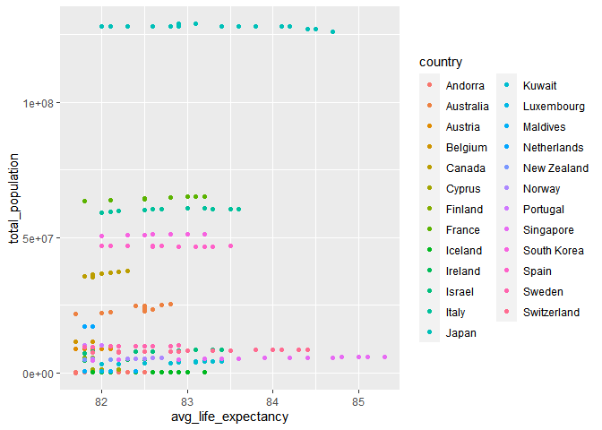

## Instructions
Answer the following questions and complete the exercises in RMarkdown. Please embed all of your code and push your final work to your repository. Your code should be organized, clean, and run free from errors. Be sure to **add your name** to the author header above. You may use any resources to answer these questions (including each other), but you may not post questions to Open Stacks or external help sites. There are 10 total questions.  

Make sure to use the formatting conventions of RMarkdown to make your report neat and clean! Your plots should use consistent aesthetics throughout.  

This exam is due by **12:00p on Tuesday, February 22**.

### Libraries 


```r
library(tidyverse)
```

```
## -- Attaching packages --------------------------------------- tidyverse 1.3.1 --
```

```
## v ggplot2 3.3.5     v purrr   0.3.4
## v tibble  3.1.6     v dplyr   1.0.7
## v tidyr   1.1.4     v stringr 1.4.0
## v readr   2.1.1     v forcats 0.5.1
```

```
## -- Conflicts ------------------------------------------ tidyverse_conflicts() --
## x dplyr::filter() masks stats::filter()
## x dplyr::lag()    masks stats::lag()
```

```r
library(here)
```

```
## here() starts at C:/Users/eliza/OneDrive/Documents/GitHub/Eliza-Mata-BIS15W2022_emata
```

```r
library(janitor)
```

```
## 
## Attaching package: 'janitor'
```

```
## The following objects are masked from 'package:stats':
## 
##     chisq.test, fisher.test
```

```r
library(skimr)
library(naniar)
```

```
## 
## Attaching package: 'naniar'
```

```
## The following object is masked from 'package:skimr':
## 
##     n_complete
```

## Gapminder
For this assignment, we are going to use data from  [gapminder](https://www.gapminder.org/). Gapminder includes information about economics, population, social issues, and life expectancy from countries all over the world. We will use three data sets, so please load all three as separate objects.    

1. population_total.csv  


```r
population_total <- read.csv("data/population_total.csv")
```

```r
poptol_t1 <- population_total
colnames(poptol_t1) <- gsub("X", "", colnames(poptol_t1))
```

2. income_per_person_gdppercapita_ppp_inflation_adjusted.csv  

```r
income_per_person <- read.csv("data/income_per_person_gdppercapita_ppp_inflation_adjusted.csv") 
```

```r
ipp_t1 <- income_per_person
colnames(ipp_t1) <- gsub("X", "", colnames(ipp_t1))
```


3. life_expectancy_years.csv  

```r
life_expectancy <- read.csv("data/life_expectancy_years.csv")
```

```r
le_t1 <- life_expectancy
colnames(le_t1) <- gsub("X", "", colnames(le_t1))
```

 * **Notes: t is short for tidy, le is short for life expectancy, ipp is short for income per person, poptol is short for population total**

1. (3 points) Once you have an idea of the structure of the data, please make each data set tidy (hint: think back to pivots) and store them as new objects. You will need both the original (wide) and tidy (long) data! 

#### Income/Person


```r
ipp_t1 [1:10,1:10]
```

```
##                country 1800 1801 1802 1803 1804 1805 1806 1807 1808
## 1          Afghanistan  603  603  603  603  603  603  603  603  603
## 2              Albania  667  667  667  667  667  668  668  668  668
## 3              Algeria  715  716  717  718  719  720  721  722  723
## 4              Andorra 1200 1200 1200 1200 1210 1210 1210 1210 1220
## 5               Angola  618  620  623  626  628  631  634  637  640
## 6  Antigua and Barbuda  757  757  757  757  757  757  757  758  758
## 7            Argentina 1640 1640 1650 1650 1660 1660 1670 1680 1680
## 8              Armenia  514  514  514  514  514  514  514  514  514
## 9            Australia  817  822  826  831  836  841  845  850  855
## 10             Austria 1850 1850 1860 1870 1880 1880 1890 1900 1910
```


```r
ipp_t2<-ipp_t1 %>%
pivot_longer(-country, names_to = "year", values_to = "income", values_drop_na = T)
ipp_t2
```

```
## # A tibble: 46,513 x 3
##    country     year  income
##    <chr>       <chr>  <int>
##  1 Afghanistan 1800     603
##  2 Afghanistan 1801     603
##  3 Afghanistan 1802     603
##  4 Afghanistan 1803     603
##  5 Afghanistan 1804     603
##  6 Afghanistan 1805     603
##  7 Afghanistan 1806     603
##  8 Afghanistan 1807     603
##  9 Afghanistan 1808     603
## 10 Afghanistan 1809     603
## # ... with 46,503 more rows
```

#### Life Expectancy  


```r
le_t1 [1:10,1:10]
```

```
##                country 1800 1801 1802 1803 1804 1805 1806 1807 1808
## 1          Afghanistan 28.2 28.2 28.2 28.2 28.2 28.2 28.1 28.1 28.1
## 2              Albania 35.4 35.4 35.4 35.4 35.4 35.4 35.4 35.4 35.4
## 3              Algeria 28.8 28.8 28.8 28.8 28.8 28.8 28.8 28.8 28.8
## 4              Andorra   NA   NA   NA   NA   NA   NA   NA   NA   NA
## 5               Angola 27.0 27.0 27.0 27.0 27.0 27.0 27.0 27.0 27.0
## 6  Antigua and Barbuda 33.5 33.5 33.5 33.5 33.5 33.5 33.5 33.5 33.5
## 7            Argentina 33.2 33.2 33.2 33.2 33.2 33.2 33.2 33.2 33.2
## 8              Armenia 34.0 34.0 34.0 34.0 34.0 34.0 34.0 34.0 34.0
## 9            Australia 34.0 34.0 34.0 34.0 34.0 34.0 34.0 34.0 34.0
## 10             Austria 34.4 34.4 34.4 34.4 34.4 34.4 34.4 34.4 34.4
```


```r
le_t2 <- le_t1 %>%
pivot_longer(-country, names_to = "year", values_to = "avg_life_expectancy", values_drop_na = T) 
le_t2
```

```
## # A tibble: 55,528 x 3
##    country     year  avg_life_expectancy
##    <chr>       <chr>               <dbl>
##  1 Afghanistan 1800                 28.2
##  2 Afghanistan 1801                 28.2
##  3 Afghanistan 1802                 28.2
##  4 Afghanistan 1803                 28.2
##  5 Afghanistan 1804                 28.2
##  6 Afghanistan 1805                 28.2
##  7 Afghanistan 1806                 28.1
##  8 Afghanistan 1807                 28.1
##  9 Afghanistan 1808                 28.1
## 10 Afghanistan 1809                 28.1
## # ... with 55,518 more rows
```

#### Population Total


```r
poptol_t1 [1:10,1:10]
```

```
##                country    1800    1801    1802    1803    1804    1805    1806
## 1          Afghanistan 3280000 3280000 3280000 3280000 3280000 3280000 3280000
## 2              Albania  400000  402000  404000  405000  407000  409000  411000
## 3              Algeria 2500000 2510000 2520000 2530000 2540000 2550000 2560000
## 4              Andorra    2650    2650    2650    2650    2650    2650    2650
## 5               Angola 1570000 1570000 1570000 1570000 1570000 1570000 1570000
## 6  Antigua and Barbuda   37000   37000   37000   37000   37000   37000   37000
## 7            Argentina  534000  520000  506000  492000  479000  466000  453000
## 8              Armenia  413000  413000  413000  413000  413000  413000  413000
## 9            Australia  200000  205000  211000  216000  222000  227000  233000
## 10             Austria 3000000 3020000 3040000 3050000 3070000 3090000 3110000
##       1807    1808
## 1  3280000 3280000
## 2   413000  414000
## 3  2560000 2570000
## 4     2650    2650
## 5  1570000 1570000
## 6    37000   37000
## 7   441000  429000
## 8   413000  413000
## 9   239000  246000
## 10 3120000 3140000
```

```r
poptol_t2 <-poptol_t1 %>%
  pivot_longer(-country, names_to = "year", values_to = "total_population", values_drop_na = T)
poptol_t2
```

```
## # A tibble: 58,695 x 3
##    country     year  total_population
##    <chr>       <chr>            <int>
##  1 Afghanistan 1800           3280000
##  2 Afghanistan 1801           3280000
##  3 Afghanistan 1802           3280000
##  4 Afghanistan 1803           3280000
##  5 Afghanistan 1804           3280000
##  6 Afghanistan 1805           3280000
##  7 Afghanistan 1806           3280000
##  8 Afghanistan 1807           3280000
##  9 Afghanistan 1808           3280000
## 10 Afghanistan 1809           3280000
## # ... with 58,685 more rows
```


2. (1 point) How many different countries are represented in the data? Provide the total number and their names. Since each data set includes different numbers of countries, you will need to do this for each one.  

```r
ipp_t2 %>%
  summarise(n_distinct(country))
```

```
## # A tibble: 1 x 1
##   `n_distinct(country)`
##                   <int>
## 1                   193
```

```r
le_t2 %>%
  summarise(n_distinct(country))
```

```
## # A tibble: 1 x 1
##   `n_distinct(country)`
##                   <int>
## 1                   187
```

```r
poptol_t2 %>%
  summarise(n_distinct(country))
```

```
## # A tibble: 1 x 1
##   `n_distinct(country)`
##                   <int>
## 1                   195
```


3. (2 points) Let's limit the data to 100 years (1920-2020). For these years, which country has the highest average life expectancy? How about the lowest average life expectancy?


```r
le_century<-le_t2 %>%
  filter(year>="1920" & year<="2020") %>%
  arrange(avg_life_expectancy) 
  le_century
```

```
## # A tibble: 18,728 x 3
##    country         year  avg_life_expectancy
##    <chr>           <chr>               <dbl>
##  1 Kazakhstan      1933                 4.07
##  2 Kazakhstan      1932                 8.15
##  3 Ukraine         1933                 8.94
##  4 Rwanda          1994                 9.64
##  5 Pakistan        1947                11.1 
##  6 Kyrgyz Republic 1921                11.9 
##  7 Lithuania       1941                12   
##  8 Belarus         1943                13.9 
##  9 Kyrgyz Republic 1922                13.9 
## 10 Turkmenistan    1933                14.2 
## # ... with 18,718 more rows
```


```r
head(le_century,5)
```

```
## # A tibble: 5 x 3
##   country    year  avg_life_expectancy
##   <chr>      <chr>               <dbl>
## 1 Kazakhstan 1933                 4.07
## 2 Kazakhstan 1932                 8.15
## 3 Ukraine    1933                 8.94
## 4 Rwanda     1994                 9.64
## 5 Pakistan   1947                11.1
```

```r
tail(le_century,5)
```

```
## # A tibble: 5 x 3
##   country   year  avg_life_expectancy
##   <chr>     <chr>               <dbl>
## 1 Singapore 2016                 84.7
## 2 Singapore 2017                 84.8
## 3 Singapore 2018                 85  
## 4 Singapore 2019                 85.1
## 5 Singapore 2020                 85.3
```

4. (3 points) Although we can see which country has the highest life expectancy for the past 100 years, we don't know which countries have changed the most. What are the top 5 countries that have experienced the biggest improvement in life expectancy between 1920-2020? 

```r
le_century_growth<- le_century%>%
  group_by(country) %>%
  summarise(max_le=max(avg_life_expectancy), min_le=min(avg_life_expectancy), 
            le_growth= max_le-min_le) %>%
  arrange(desc(le_growth))
le_century_growth
```

```
## # A tibble: 187 x 4
##    country         max_le min_le le_growth
##    <chr>            <dbl>  <dbl>     <dbl>
##  1 Kazakhstan        73.1   4.07      69.0
##  2 Lithuania         75.6  12         63.6
##  3 Poland            78.5  15.4       63.1
##  4 Ukraine           71.8   8.94      62.9
##  5 Kyrgyz Republic   73.1  11.9       61.2
##  6 Belarus           74.6  13.9       60.7
##  7 Rwanda            69.5   9.64      59.9
##  8 Vietnam           74.8  15.9       58.9
##  9 Kuwait            83.4  26.6       56.8
## 10 Russia            72.7  16         56.7
## # ... with 177 more rows
```


5. (3 points) Make a plot that shows the change over the past 100 years for the country with the biggest improvement in life expectancy. Be sure to add appropriate aesthetics to make the plot clean and clear. Once you have made the plot, do a little internet searching and see if you can discover what historical event may have contributed to this remarkable change.  

```r
le_century_growth_kazakhstan <- le_century_growth %>%
  filter(country=="Kazakhstan") 
le_century_growth_kazakhstan
```

```
## # A tibble: 1 x 4
##   country    max_le min_le le_growth
##   <chr>       <dbl>  <dbl>     <dbl>
## 1 Kazakhstan   73.1   4.07      69.0
```


```r
le_century %>%
  filter(country == "Kazakhstan") %>%
  ggplot(aes(x=year, y=avg_life_expectancy, color=avg_life_expectancy, group=country)) +geom_point()+geom_line() +theme(axis.text.x = element_text(angle = 60, size = 3)) +
  labs(title = "Kazakhstan Life Expectancy",x = "Year", y= "Average Life Expectancy")
```

<!-- -->

## Population Growth
6. (3 points) Which 5 countries have had the highest population growth over the past 100 years (1920-2020)?  

```r
poptol_century <- poptol_t2 %>%
  filter(year>="1920" & year<="2020") %>%
  arrange(desc(total_population))
poptol_century
```

```
## # A tibble: 19,695 x 3
##    country year  total_population
##    <chr>   <chr>            <int>
##  1 China   2020        1440000000
##  2 China   2018        1430000000
##  3 China   2019        1430000000
##  4 China   2017        1420000000
##  5 China   2015        1410000000
##  6 China   2016        1410000000
##  7 China   2014        1400000000
##  8 China   2013        1390000000
##  9 China   2011        1380000000
## 10 China   2012        1380000000
## # ... with 19,685 more rows
```

```r
poptol_century_growth <- poptol_century %>%
  group_by(country) %>%
  summarise(max_pop=max(total_population), min_pop=min(total_population), 
            pop_growth= max_pop-min_pop) %>%
  arrange(desc(pop_growth))
```

```r
head(poptol_century_growth,5)
```

```
## # A tibble: 5 x 4
##   country          max_pop   min_pop pop_growth
##   <chr>              <int>     <int>      <int>
## 1 India         1380000000 317000000 1063000000
## 2 China         1440000000 472000000  968000000
## 3 Indonesia      274000000  47300000  226700000
## 4 United States  331000000 111000000  220000000
## 5 Pakistan       221000000  21700000  199300000
```


7. (4 points) Produce a plot that shows the 5 countries that have had the highest population growth over the past 100 years (1920-2020). Which countries appear to have had exponential growth? 


```r
poptol_century %>%
  filter(country %in% c("India", "China", "Indonesia", "United States", "Pakistan")) %>%
   ggplot(aes(x=year, y=total_population, color=country, group=country)) +geom_point() +theme(axis.text.x = element_text(angle = 60, size = 3))
```

<!-- -->

 * **China and India are growing exponentially**
 
## Income
The units used for income are gross domestic product per person adjusted for differences in purchasing power in international dollars.

8. (4 points) As in the previous questions, which countries have experienced the biggest growth in per person GDP. Show this as a table and then plot the changes for the top 5 countries. With a bit of research, you should be able to explain the dramatic downturns of the wealthiest economies that occurred during the 1980's.  

```r
ipp_t2 %>%
  group_by(country) %>%
  summarise(max_ipp=max(income), min_ipp=min(income), 
            ipp_growth= max_ipp-min_ipp) %>%
  arrange(desc(ipp_growth)) %>%
  head(5)
```

```
## # A tibble: 5 x 4
##   country              max_ipp min_ipp ipp_growth
##   <chr>                  <int>   <int>      <int>
## 1 United Arab Emirates  179000     998     178002
## 2 Qatar                 179000    1080     177920
## 3 Brunei                166000    1510     164490
## 4 Kuwait                143000    1100     141900
## 5 Singapore             133000    1020     131980
```

```r
ipp_t2 %>%
  filter(country %in% c("United Arab Emirates", "Qatar", "Brunei", "Kuwait", "Singapore")) %>%
  filter(year>= "1950") %>%
   ggplot(aes(x=year, y=income, color=country, group=country)) +geom_point() +theme(axis.text.x = element_text(angle = 60, size = 3))
```

<!-- -->

 * **Around this time there was an oil boom**
 
9. (3 points) Create three new objects that restrict each data set (life expectancy, population, income) to the years 1920-2020. Hint: I suggest doing this with the long form of your data. Once this is done, merge all three data sets using the code I provide below. You may need to adjust the code depending on how you have named your objects. I called mine `life_expectancy_100`, `population_100`, and `income_100`. For some of you, learning these `joins` will be important for your project.  

```r
ipp_century <-ipp_t2 %>%
   filter(year>="1920" & year<="2020") %>%
  arrange(desc(income))
```


```r
gapminder_join <- inner_join(le_century, poptol_century, by= c("country", "year"))
gapminder_join <- inner_join(gapminder_join, ipp_century, by= c("country", "year"))
gapminder_join
```

```
## # A tibble: 18,728 x 5
##    country         year  avg_life_expectancy total_population income
##    <chr>           <chr>               <dbl>            <int>  <int>
##  1 Kazakhstan      1933                 4.07          5630000   3130
##  2 Kazakhstan      1932                 8.15          5580000   3010
##  3 Ukraine         1933                 8.94         31800000   2070
##  4 Rwanda          1994                 9.64          5940000    503
##  5 Pakistan        1947                11.1          35400000   1280
##  6 Kyrgyz Republic 1921                11.9           1320000   1330
##  7 Lithuania       1941                12             2460000   4870
##  8 Belarus         1943                13.9           7280000   2040
##  9 Kyrgyz Republic 1922                13.9           1340000   1360
## 10 Turkmenistan    1933                14.2           1030000   2590
## # ... with 18,718 more rows
```

10. (4 points) Use the joined data to perform an analysis of your choice. The analysis should include a comparison between two or more of the variables `life_expectancy`, `population`, or `income.`  

```r
gapminder_join %>%
  arrange(desc(avg_life_expectancy)) %>%
  head(200) %>%
  ggplot(aes(x=avg_life_expectancy, y=total_population, color=country)) +geom_point()
```

<!-- -->

